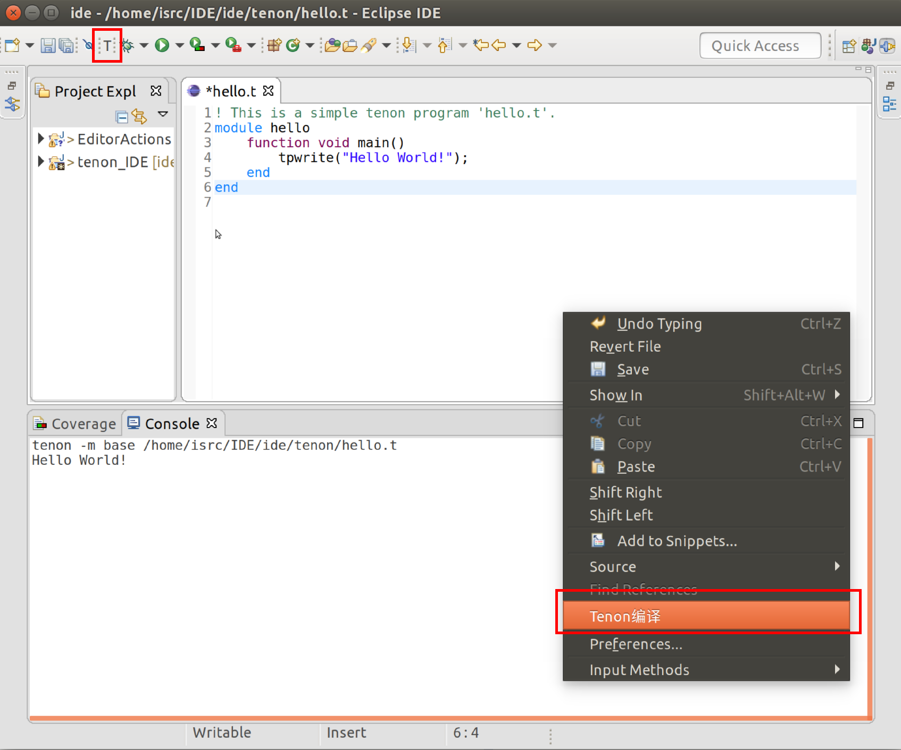

# IDE

IDE for quantum program development and compilation.

## 基础版本

### Eclipse 2019.03
[Linux](https://www.eclipse.org/downloads/download.php?file=/technology/epp/downloads/release/2019-03/R/eclipse-committers-2019-03-R-linux-gtk-x86_64.tar.gz&amp;mirror_id=1142)

[Mac](https://www.eclipse.org/downloads/download.php?file=/technology/epp/downloads/release/2019-03/R/eclipse-committers-2019-03-R-macosx-cocoa-x86_64.dmg&mirror_id=1142)

[Windows](https://www.eclipse.org/downloads/download.php?file=/technology/epp/downloads/release/2019-03/R/eclipse-committers-2019-03-R-win32-x86_64.zip&mirror_id=1142)

## 文件

### tenon 

tenon编译器及其文档

### plugins

生成好的插件jar包

### tenon_IDE

tenon Eclipse插件的源代码

### EditorAction

Eclipse插件的依赖文件

## 插件安装

 1. 复制 *./plugins/TenonEditor_XXX.jar* 到 *Eclipse安装目录/pulgins/* 目录下
 2. 启动/重启Eclipse

## 插件使用

### V1.0
实现了Tenon编辑器代码高亮和编译器调用功能

#### 编译.t文件并查看执行结果：

两种方式
 - 在.t文件页面单击右键，单击“Tenon编译”按钮
 - 直接单击工具栏中 “T” 图标

下方Console窗口中显示运行的编译指令及执行结果

 

