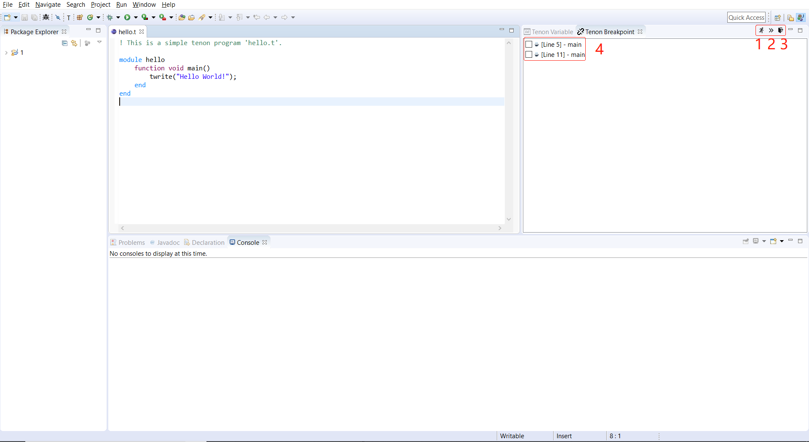

# IDE

IDE for quantum program development and compilation.

## 基础版本

### Eclipse 2019.03
[Linux](https://www.eclipse.org/downloads/download.php?file=/technology/epp/downloads/release/2019-03/R/eclipse-committers-2019-03-R-linux-gtk-x86_64.tar.gz&amp;mirror_id=1142)

[Mac](https://www.eclipse.org/downloads/download.php?file=/technology/epp/downloads/release/2019-03/R/eclipse-committers-2019-03-R-macosx-cocoa-x86_64.dmg&mirror_id=1142)

[Windows](https://www.eclipse.org/downloads/download.php?file=/technology/epp/downloads/release/2019-03/R/eclipse-committers-2019-03-R-win32-x86_64.zip&mirror_id=1142)

## 文件

### tenon 

tenon编译器及其文档

### plugins

生成好的插件jar包

### tenon_IDE

tenon Eclipse插件的源代码

### EditorAction

Eclipse插件的依赖文件

## 插件安装

 1. 复制 *./plugins/TenonEditor_0.4.0.jar* 到 *Eclipse安装目录/plugins/* 目录下
 2. 启动/重启Eclipse

## 插件使用

### V0.1.0
实现了Tenon编辑器代码高亮和编译器调用功能

#### 编译.t文件并查看执行结果：

两种方式
 - 在.t文件页面单击右键，单击“Tenon编译”按钮
 - 直接单击工具栏中 “T” 图标

下方Console窗口中显示运行的编译指令及执行结果

### V0.2.0
实现了部分Debug视图和Tvm模式调试功能

#### 打开Debug视图，查看断点的变量：

两种方法
 - 在.t文件页面单击右键，单击“Tenon调试”按钮
 - 直接单击工具栏中 “爬虫” 图标
 
右侧窗口中显示变量视图和断点视图（断点视图暂时为占位符）

#### 进入Tvm模式调试程序

打开方式: 在.t文件页面单击右键，单击“Tvm模式开启”按钮

进入Tvm模式后，支持
 - 在Tvm模式下运行程序
 - 设置断点
 - 下一步（跳过断点）
 - 退出Tvm模式

### V0.3.0
初步实现Debug视图，完成Breakpoint视图，支持多次发送Tvm调试指令。

#### 打开Debug视图，查看断点的两个视图

两种方法
 - 在.t文件页面单击右键，单击“Tenon调试”按钮
 - 直接单击工具栏中 “爬虫” 图标

右侧窗口中显示变量视图和断点视图，V0.3.0实现了三个按钮，对应三个已实现的tvm调试模式下的功能（但按钮未实现真正的功能）
 - 在Tvm模式下运行程序 （图中图标1）
 - 下一步（跳过断点） （图中图标2）
 - 退出Tvm模式 （图中图标3）
 - 当前断点一览 （图中图标4）
 

#### 进入Tvm模式调试程序

打开方式: 在.t文件页面单击右键，单击“Tvm模式开启”按钮

进入Tvm模式后，支持
 - 在Tvm模式下运行程序
 - 设置断点
 - 下一步（跳过断点）
 - 退出Tvm模式

V0.3.0版本支持了多次发送Tvm调试指令，包括多次开关tvm模式，多次设置断点。

### V0.4.0
完成Debug视图，包括Brekpoint和Variable视图，支持更多Tvm调试命令。对于已实现的调试功能，可以通过右键菜单或Debug视图中的对应按钮使用。实现了I18N，支持中文和英文两种语言。

#### 打开Debug视图，查看断点的两个视图

两种方法
 - 在.t文件页面单击右键，单击“Tenon调试”按钮
 - 直接单击工具栏中 “爬虫” 图标

右侧窗口中显示变量视图和断点视图，V0.4.0实现了12个按钮，一一对应tvm调试模式下的功能。对于已实现的功能，可以通过按钮来使用。

对于图标8-11（对于断点的赋能和临时关闭的操作），目前只有UI界面，没有实现后台功能。图中13图标中的断点一览第一列的对错符号代表断点目前的状态。

 - Start Tvm Mode（图中图标1）
 - Run（图中图标2）
 - Next（图中图标3）
 - Step（图中图标4）
 - Stepi（图中图标5）
 - Continue（图中图标6）
 - Backtrace（图中图标7）
 - Enable Selected Breakpoint（图中图标8）
 - Enable All Breakpoint（图中图标9）
 - Disable Selected Breakpoint（图中图标10）
 - Disable All Breakpoint（图中图标11）
 - Quit Tvm Mode（图中图标12）
 - 当前断点一览 （图中图标13）

根据操作系统语言设置，编译器会显示对应的语言，目前支持简体中文和英文，默认语言为简体中文。

不支持自定义断点功能，目前断点设置硬编码为第五行。自定义断点功能将于下个版本实现。